# Yu Code

> 把 Pi Agent 搬进桌面：会弹权限确认、能拆子任务、关机也不丢上下文。

Yu Code 是 Pi Agent（[`@earendil-works/pi-coding-agent`](https://www.npmjs.com/package/@earendil-works/pi-coding-agent)）的桌面客户端。

我们不重造 Agent，只做一件事：把命令行里那套能力，变成一个看得见、摸得着、敢用的界面。

## 为什么做这个

Pi Agent 的能力足够强，但它只有 CLI 一种形态。对命令行熟练的用户，这是优点；可下面几条叠在一起，对更多人来说，「极简」就变成了「劝退」：

| Pi Agent 的痛点 | Yu Code 的做法 |
| --- | --- |
| 只有 CLI 形态：开一个新对话，要新开终端再敲命令，操作繁琐 | 桌面客户端，对话框里直接聊；对话按目录保存，关掉再开还在 |
| 执行文件 / 命令前没有二次确认，安全边界全靠用户自己把住，心理门槛高 | 危险操作先弹卡确认；读写 `.env`、私钥这类凭据文件默认拦下，不需要也可以关 |
| 不支持子任务拆分与委派，复杂任务处理能力受限 | 主 Agent 能拆子任务再派出去：多个子任务并行跑，也可以丢后台，跑完把结论回填 |
| 会话状态易丢失：进程退出、关机或重启后，原有上下文不易恢复 | 工作区状态与对话落到本地文件，重开即续；计划单独落盘，不随上下文一起消失 |
| 上下文一长就撑不住，长任务做到一半就断 | 上下文自动压缩，同时把计划写在磁盘上、每轮重新注入，跨压缩、跨重启接着做 |

## 功能

- **对话式客户端**：多标签对话、流式输出、Markdown 与代码高亮
- **执行流程可视化**：思考 / 工具调用 / 结果按时间线展开，子代理进度单独成条
- **权限确认**：危险命令、凭据文件访问前弹卡确认
- **子任务委派**：并行、后台、可写角色的子代理
- **上下文管理**：自动压缩，外加主动 `compress` / `decompress` / `search_context`
- **计划与待办**：计划落盘，长任务看得见、接得上
- **IDE 能力**：文件树、CodeMirror 编辑器与只读查看器、多语言高亮、诊断、符号搜索
- **内置终端**：xterm + node-pty，跟随当前工作区
- **模型接入**：任意 OpenAI 兼容接口，多模型切换
- **扩展 / 技能 / MCP**：装扩展、加技能、接 MCP 服务
- **开箱即用**：Pi 运行时与便携 Node 随安装包带好，不用另装

## 截图

| | |
| :--: | :--: |
| 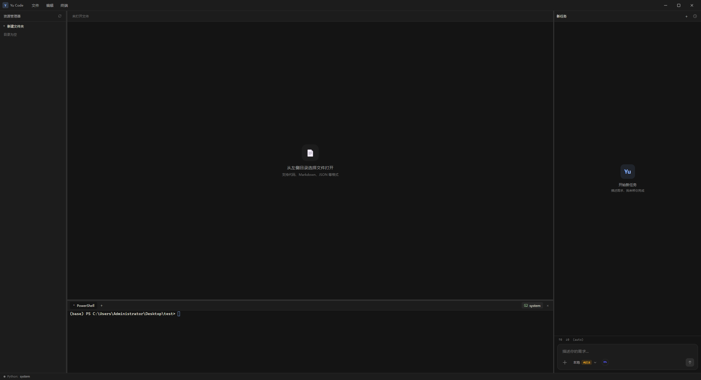<br>整体界面 | 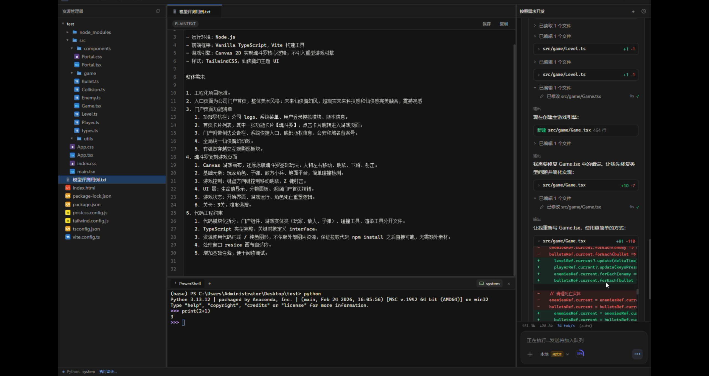<br>实际使用 |
| <br>对话框 | 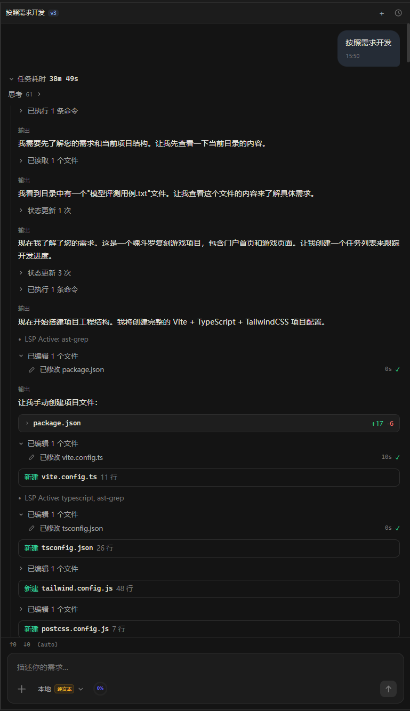<br>执行流程 |
| 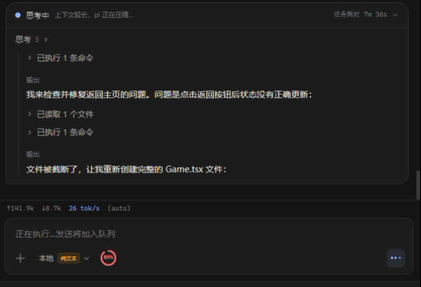<br>上下文自动压缩 | 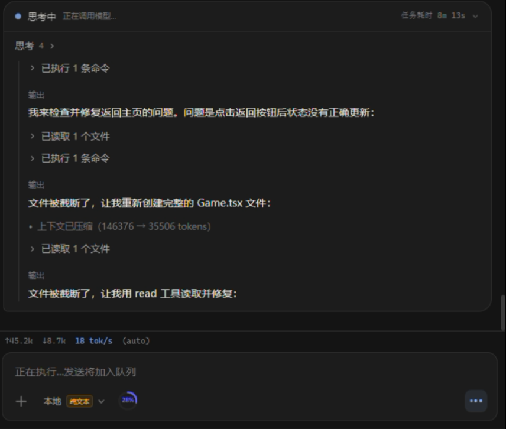<br>压缩之后 |
| 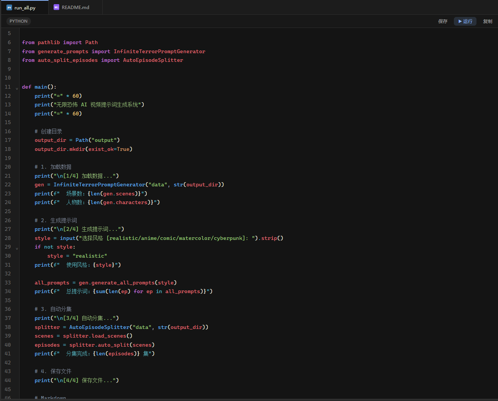<br>代码高亮，带 IDE 能力 | 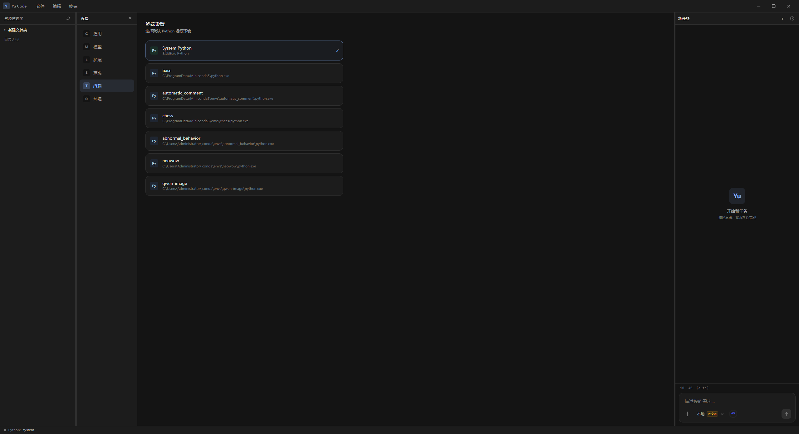<br>内置终端 |
| 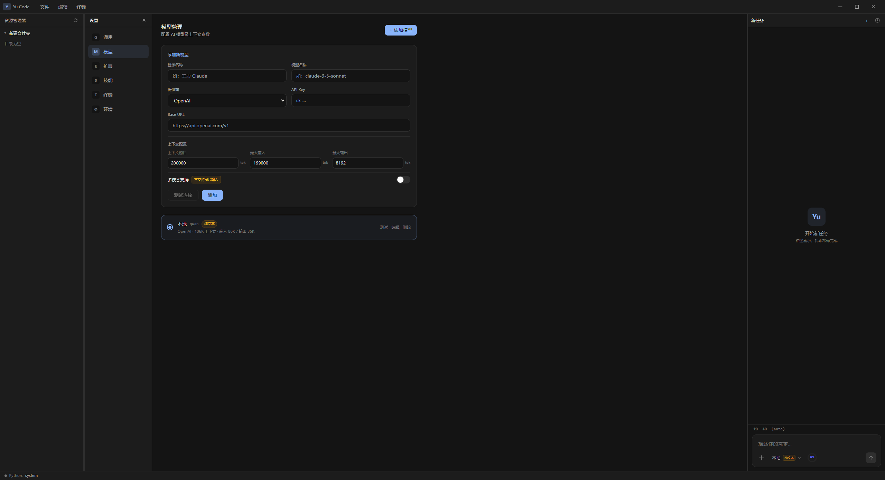<br>添加模型 | 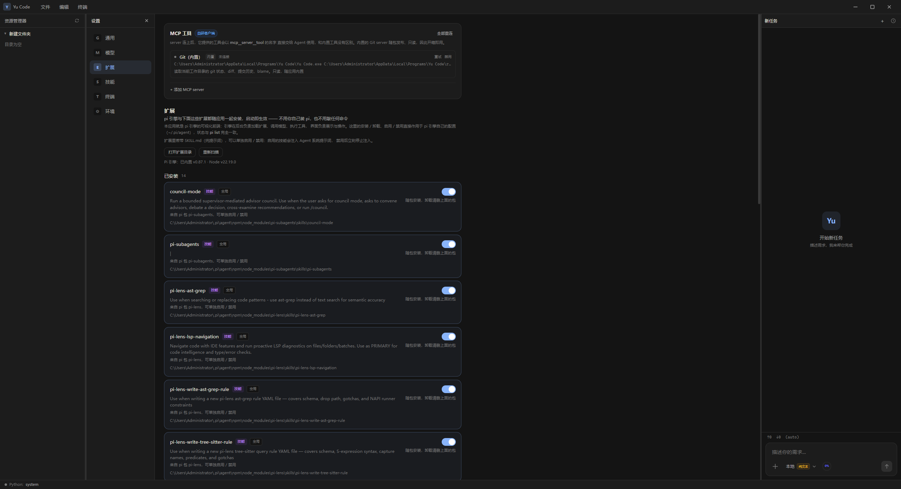<br>扩展 |
| 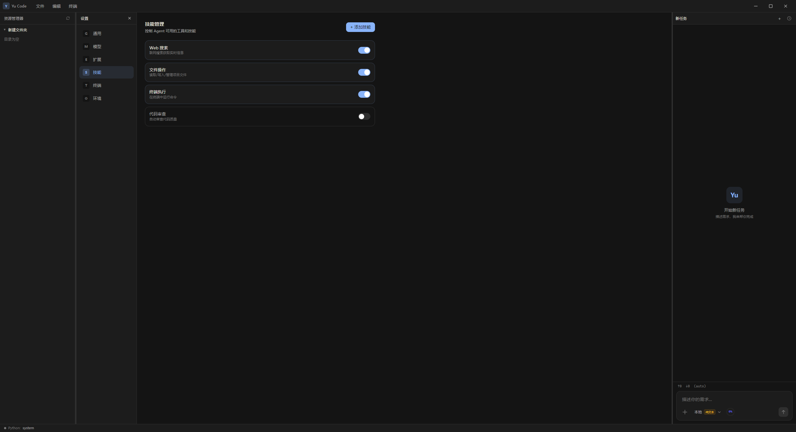<br>技能 | 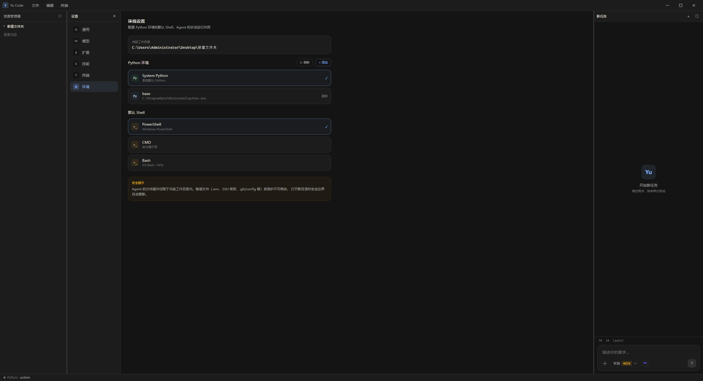<br>环境 |

## 下载与安装

到 [Releases](../../releases) 下载最新的 `Yu Code Setup x.y.z.exe`。

- 安装包里已经带好 Pi 运行时和便携 Node，**不需要**另外安装 Pi 或 Node
- 支持自选安装目录，按用户安装，无需管理员权限
- 装完后可以在文件夹上右键 →「用 Yu Code 打开」（Windows 11 需先点「显示更多选项」）

目前提供 Windows x64 安装包。

## 本地开发

```bash
npm install
npm run dev      # 同时起 Vite 和 Electron
npm run build    # 版本号自增 → 备 pi 运行时 → 构建前端 → 出安装包
```

`npm run build` 的产物默认落在工作区外的 `../yu_code-release`（见 `electron-builder.json`）。第一次构建会下载 Pi 运行时与便携 Node，需要能访问 nodejs.org 和 npm registry。

## 技术栈

Electron · React 18 · TypeScript · Vite · Zustand · CodeMirror 6 · xterm.js

## 参与贡献

欢迎提 Issue 和 PR。

项目处在收尾阶段，原则是：**以修 bug 和体验优化为前提，非必要不加新功能**，优先保证正确、可用、极简。

## 关于

由 **资阳夜辰人工智能科技有限公司（羽修）** 开发并开源。

## 许可

[MIT](LICENSE)

安装包内附带 Pi 运行时与便携 Node，其版权归各自作者所有。
